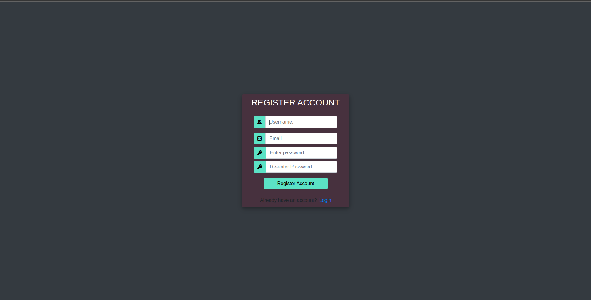
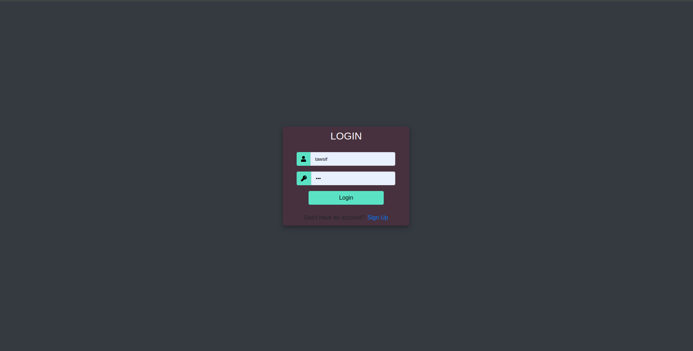
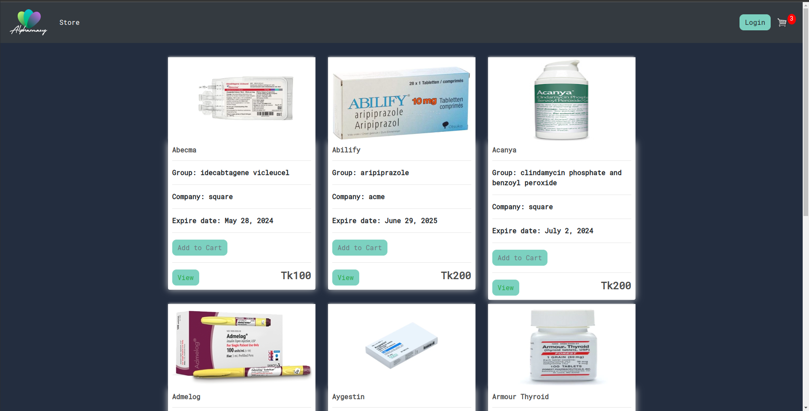
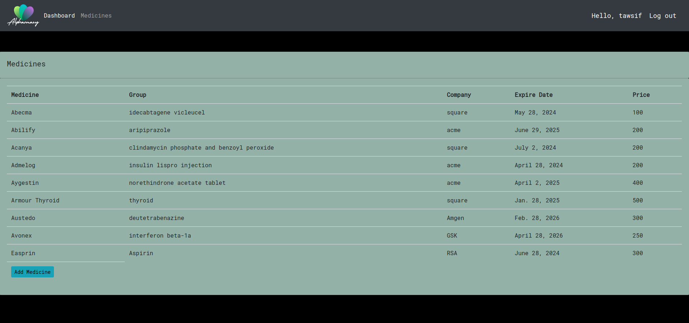
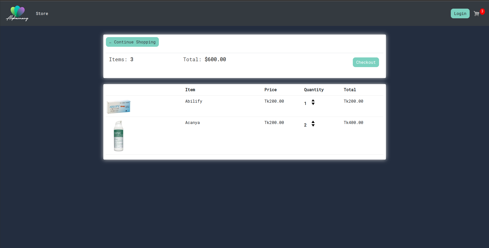
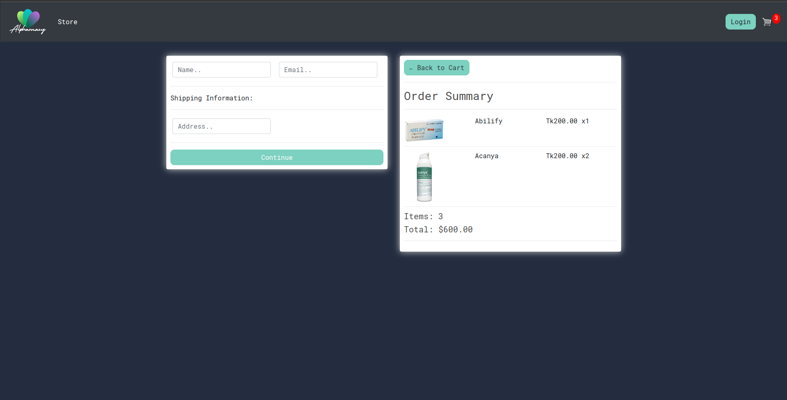

# Online Pharmacy Management System

### Created by: Md. Tawsifur Rahman

This repository hosts an Online Pharmacy Management System, equipped with various features to facilitate seamless pharmacy operations.

## Project Features

### Implemented Features
- **Registration/Login System:** Allows users to create accounts and securely log in.
  
  

- **Medicine Purchase:** Enables users to buy medicines online.
  
- **Medicine Details:** Provides comprehensive details about available medicines.
  
- **Order Placement:** Allows users to place orders for medicines.
  
  
- **Delivery System:** Manages the delivery process for orders.
- **Customer Details:** Stores and manages customer information.
- **Medicine Search:** Enables users to search for available medicines.
- **Admin Functionality:**
  - **Add New Products:** Allows admin to add new medicines to the system.
  - **Update Pending Orders:** Enables admin to manage pending orders.
  - **View Statistics:**
    - Total Customer Numbers.
    - Total Orders Placed.
  - **Customer Management:**
    - Delete Customers from the system.

### Online Resources Used
#### References:
- [Django Documentation](https://docs.djangoproject.com/)

## Future Enhancements
The system can be further enhanced to provide additional functionalities, including:
- **Different Payment Methods:** Integrate multiple payment options.
- **Nearby Pharmacies Display:** Show nearby pharmacies within the app.
- **Online Chat Sessions:** Implement live chat support for users.
